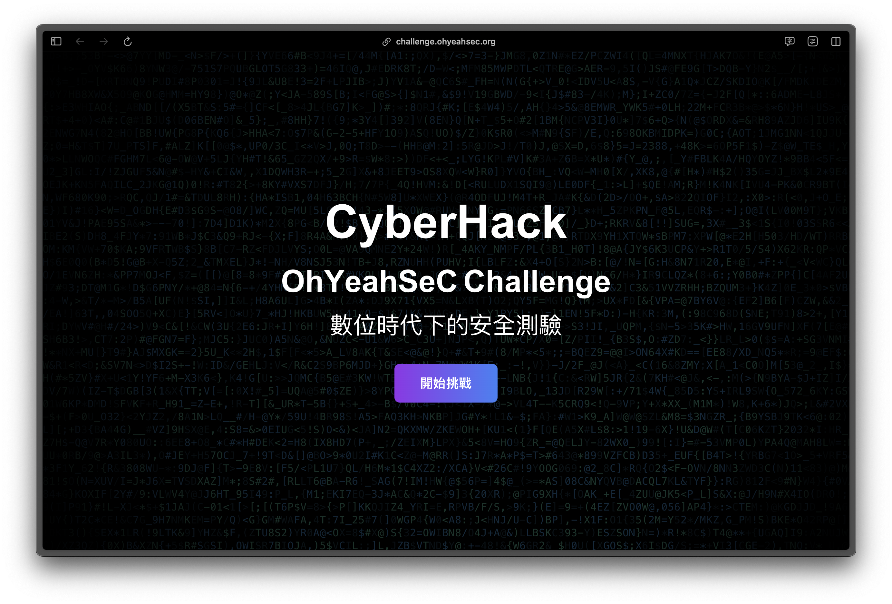

# OhYeahSeC CTF Challenge



### 🔗 https://challenge.ohyeahsec.org

## 專案概述

OhYeahSeC CTF Challenge 是一個互動式網頁平台，提供一系列資訊安全相關的挑戰題目。參與者需要運用各種資安技能，包括密碼學、Web安全、隱寫術等，來解決挑戰並找出隱藏的FLAG。

該平台採用Next.js框架開發，具有現代化的界面設計和流暢的用戶體驗，適合給予剛接觸資安的夥伴體驗，或資訊安全相關介紹後的實作。

## 功能特點

- **精心設計的挑戰關卡**：涵蓋從基礎密碼學到Web安全等多種資安主題
- **逐步引導的學習體驗**：參與者需順序解決挑戰，難度逐步提升
- **簡易的解題環境** ：可以使用瀏覽器就可以體驗到更領域的關卡

## 技術堆疊

- **框架**: Next.js 15.1.7
- **前端**: React, TypeScript, Tailwind CSS
- **動畫**: [reactbit](https://www.reactbits.dev/text-animations/blur-text)
- **部署**: Vercel

## 挑戰類型

平台包含多種不同類型的資安挑戰：

1. **基礎密碼學**：包括凱薩密碼、Base64解碼等
2. **程式碼分析**：修復或分析有錯誤的代碼
3. **Web安全**：分析前端代碼尋找隱藏信息
4. **視覺密碼學**：通過圖像處理和分析發現隱藏信息
5. **社交工程**：使用OSINT（開源情報）技術尋找信息

## 本地開發

### 前提條件

- Node.js 18.x 或更高版本
- npm 或 yarn

### 安裝與運行

1. 克隆儲存庫
   ```bash
   git clone https://github.com/osga24/OhYeahSeC-CTF-Challenge.git
   cd OhYeahSeC-CTF-Challenge
   ```

2. 安裝依賴
   ```bash
   npm install
   # 或
   yarn install
   ```

3. 啟動開發服務器
   ```bash
   npm run dev
   # 或
   yarn dev
   ```

4. 開啟瀏覽器並訪問 `http://localhost:3000`

## 部署

此專案配置為在Vercel上部署：

1. Fork 或克隆此儲存庫到您的GitHub帳戶
2. 在Vercel中導入該專案
3. 設置環境變量（如需要）
4. 部署！

## 自定義挑戰

如果您想添加或修改挑戰：

1. 在 `src/app/challenge/` 目錄下為每個挑戰創建新的文件夾
2. 參考現有挑戰的結構和命名約定
3. 更新相關的FLAG值和挑戰內容

## 貢獻指南

歡迎提交問題報告、功能請求或直接提交Pull Request。請確保您的代碼與現有的編碼風格一致，並通過所有測試。

## 授權協議

此專案採用 MIT 授權協議 - 詳見 [LICENSE](LICENSE) 文件

## 聯繫方式

有任何問題或建議，歡迎私訊我的任何聯絡方式 contact to [OsGa](https://www.osga.dev/contact)。

---

Happy Hacking! 🚀
